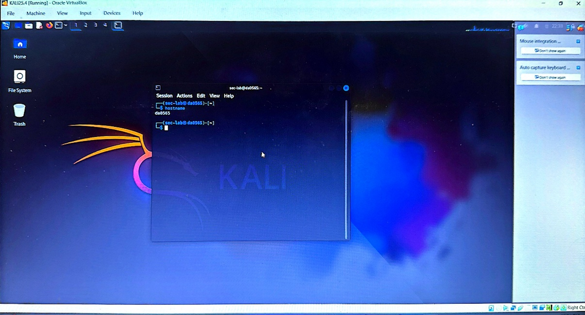
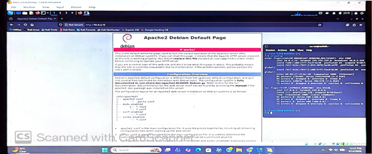
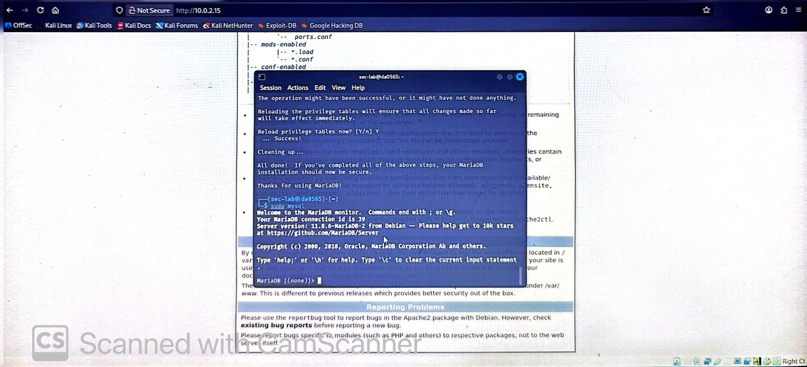
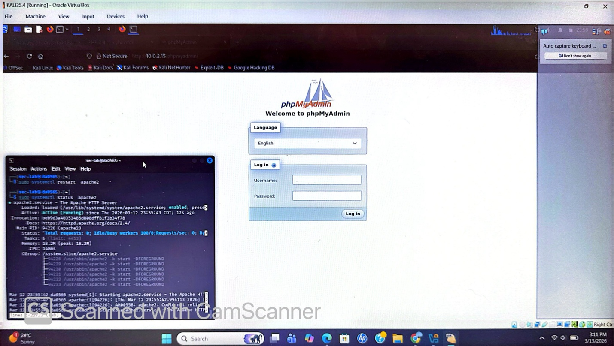
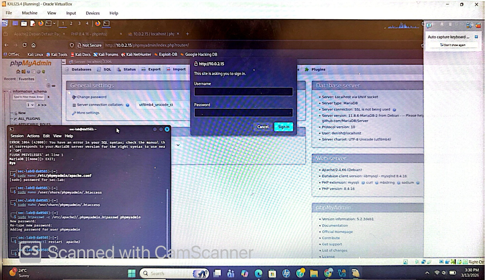
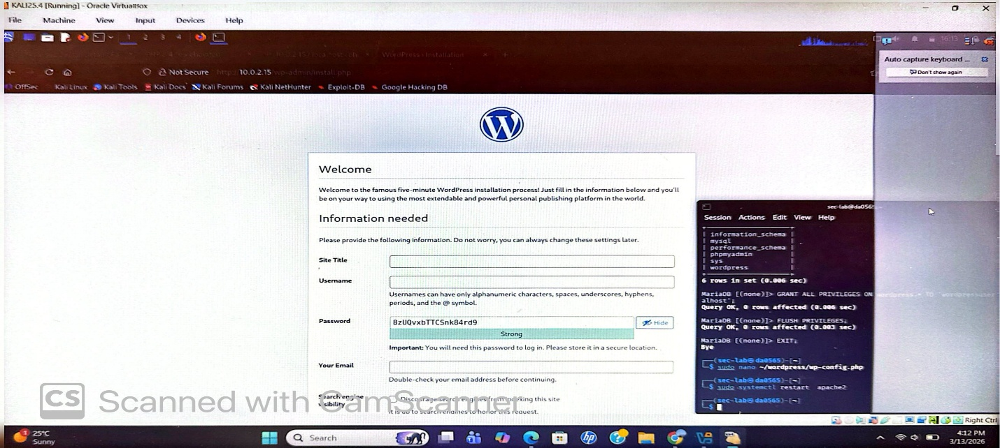
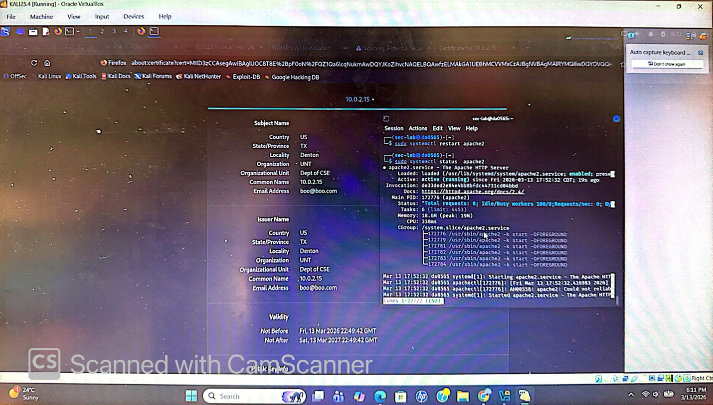

# lab1-fullstack-kali-server-setup
Full-stack server environment setup on Kali Linux including Apache, MariaDB, PHP, phpMyAdmin, WordPress, and SSL configuration.
The goal of this lab is to understand how web servers, databases, and secure communication work together in a real-world environment.

---

## Analyst Information

- **Name:** Denish Adhikari  
- **Role:** Cybersecurity Student | Security Analyst (Training Lab)  
- **Environment:** Kali Linux Virtual Machine  

---

## Objectives

- Configure a full-stack Linux server environment  
- Deploy web, database, and application layers  
- Identify default security risks  
- Apply system hardening techniques  
- Implement secure communication using SSL  

---

## Technologies Used

- Kali Linux  
- Apache Web Server  
- MariaDB  
- PHP  
- phpMyAdmin  
- WordPress  
- OpenSSL  

---

## System Architecture

- **Web Server:** Apache  
- **Database Server:** MariaDB  
- **Backend Language:** PHP  
- **Database Interface:** phpMyAdmin  
- **Application Layer:** WordPress CMS  
- **Security Layer:** SSL/TLS encryption  

---

## Default Security Risks Identified

Before hardening, the system presented several common security risks:

- phpMyAdmin exposed to public access  
- No HTTPS (data transmitted in plaintext)  
- Default MariaDB configurations (weak security)  
- Potential Apache information disclosure  
- No access restrictions on sensitive services  
- Lack of encryption for authentication and data transfer  

---

## Security Hardening Implemented

The following security measures were applied to reduce the attack surface:

### Database Security (MariaDB)
- Executed `mysql_secure_installation`
- Removed anonymous users  
- Disabled remote root login  
- Removed test database  
- Enforced strong root password  

---

### Web Server Security (Apache)
- Verified secure Apache configuration  
- Limited unnecessary exposure of directories  
- Reduced server information disclosure  

---

### phpMyAdmin Protection
- Configured authentication controls  
- Restricted access to authorized users only  

---

### SSL/TLS Encryption
- Generated self-signed SSL certificate using OpenSSL  
- Enabled HTTPS for secure communication  
- Encrypted data transmission between client and server  

---

### Application Deployment (WordPress)
- Configured secure database connection  
- Deployed CMS within hardened environment  

---

## Attack Scenarios (Threat Perspective)

The following attack vectors were possible before hardening:

1. **phpMyAdmin Exposure**
   - Attacker accesses database panel → brute force login  

2. **Unencrypted Communication**
   - Interception of credentials via Man-in-the-Middle (MITM) attacks  

3. **Weak Database Configuration**
   - Unauthorized access using default settings  

4. **Apache Misconfiguration**
   - Information leakage enabling targeted attacks  

---

## Remediation Summary

| Risk | Mitigation |
|------|-----------|
| Public phpMyAdmin access | Restricted and secured authentication |
| No HTTPS | Implemented SSL/TLS encryption |
| Weak database security | Hardened using secure installation |
| Data interception risk | Encrypted communication |
| Default configurations | Applied secure configurations |

---

## Security Outcome

After implementing security controls:

- Reduced attack surface significantly  
- Secured authentication and database access  
- Enforced encrypted communication (HTTPS)  
- Improved overall system security posture  

---

## Screenshots

### Server Setup

### Apache Web Server

### MariaDB Setup

### PHP Verification

### phpMyAdmin Security

### WordPress Setup

### SSL Configuration

---

## Key Learnings

- Identified risks in default server configurations  
- Learned how to harden a full-stack environment  
- Gained experience securing database and admin interfaces  
- Understood importance of HTTPS and encrypted communication  
- Developed foundational skills in web server security  

---

## Skills Demonstrated

- Linux Server Setup & Administration  
- Web Server Configuration (Apache)  
- Database Security (MariaDB)  
- Web Application Deployment (WordPress)  
- SSL/TLS Implementation  
- Security Hardening & Risk Reduction  

---

## Conclusion

This project demonstrates how insecure default configurations in a full-stack environment can expose systems to significant risks. By applying structured security hardening techniques, the system was transformed into a more secure and resilient environment.

The lab reflects foundational skills required for roles in:
- Security Operations Center (SOC)  
- Vulnerability Assessment  
- System Hardening & Defense  

---

## Author

**Denish Adhikari**  
Cybersecurity Student | Aspiring Security Analyst 
